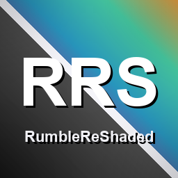

  

# RumbleReShaded

**Shaders for RUMBLE.** A MelonLoader mod that loads community-made **shader packs** and
applies them as full-screen post-processing on your view — color grading, bloom, film
grain, fog, CRT looks, grayscale, and whatever else people dream up. Think *Minecraft
shaders, but for RUMBLE*: drop a pack in a folder, toggle it on, and the whole game gets
a new look.

Every effect is applied **after the game finishes drawing the frame**, so it covers
*everything* you see — the arena, your hands, particles, trails and world-space UI — in
both eyes, with full VR support.

## Requirements

- **RUMBLE** (PC / Steam)
- **MelonLoader**
- **UIFramework** (`Reverb_and___and_Spice-UIFramework`) — RumbleReShaded registers all its
  toggles and sliders there. Install it too if you don't have it.

## Install

Download **`RumbleReShaded.zip`** (in this repo) and unzip it anywhere — your Downloads
folder is fine. Then copy its contents into your RUMBLE install:

- `Mods/RumbleReShaded.dll` → `RUMBLE/Mods/`
- `UserData/*` → `RUMBLE/UserData/` (the example pack folders)

Packs go **one level under `UserData/`** — so you end up with `RUMBLE/UserData/Grayscale/`
and `RUMBLE/UserData/UltraShade/`, each containing a `manifest.json`. Folders without a
manifest are ignored, so this sits happily alongside other mods' `UserData` folders.

(Your RUMBLE folder is the one with `RUMBLE.exe` — e.g. `…/steamapps/common/RUMBLE`.)

Launch the game and open the **UIFramework** menu (default: **F9** on a keyboard, or in VR
press both triggers + both face buttons **A/X** together). Find **RumbleReShaded**, toggle a
pack on, and adjust its sliders — changes apply live as you drag.

## Included packs

Two example packs ship in `UserData/` — both genuinely usable, not just demos:

- **Grayscale** — one *Strength* slider, desaturates the whole view. The "hello world" of
  RumbleShade.
- **UltraShade** — a full cinematic grading stack: ACES tonemapping, exposure, white
  balance, saturation/contrast, soft bloom, sharpening, chromatic aberration, film grain,
  vignette, and depth-based atmospheric fog. Every stage has its own slider.

You can run several packs at once — they apply in order (lowest render queue first), each
processing the result of the previous, so an overlay pack (grain, vignette) layers cleanly
on top of a grading pack.

## Make your own packs

RumbleReShaded is really a **host**: it solves the hard part of RUMBLE shaders *once, for
everyone*, so you only have to write the look. Getting a full-screen effect to cover the
whole frame — particles and all — in both eyes in VR means an injected URP RenderGraph
pass, stereo handling, MSAA resolves, the variant-stripping gotchas… all of that lives in
the mod. You never touch C#, MelonLoader or any of the rendering plumbing.

What's left for you is just a **fragment shader** — and you don't even need to know HLSL.
You can describe the look you want in plain English ("cold horror — desaturated, heavy
grain, dark edges", "retro CRT", "warm golden-hour film") and have an AI write the shader,
then build it.

> **One honest caveat:** because RUMBLE is an Il2Cpp build with no runtime shader compiler,
> every shader — in *any* RUMBLE mod — has to be pre-compiled into a Unity AssetBundle.
> So you do need Unity to build a pack. The companion **[RumbleShade](RumbleShade/)** template project makes
> that a one-click "Build Shader Packs" step; you don't configure anything. That build is
> the only tool requirement, and it's the same step every RUMBLE shader modder already does.

See the **[`ShaderCreation/`](ShaderCreation/)** folder included here:

- **[MAKING_SHADERS_WITH_CLAUDE.md](ShaderCreation/MAKING_SHADERS_WITH_CLAUDE.md)** — the
  AI workflow + a ready-to-paste prompt that already encodes every rule a pack shader
  must follow.
- **[AUTHORING_GUIDE.md](ShaderCreation/AUTHORING_GUIDE.md)** — the full authoring guide:
  what screen-space shaders can and can't do, the shader convention, the build process,
  and a troubleshooting table.

The packs are built from the companion **[RumbleShade](RumbleShade/)** Unity template
project, included in this repo — open `RumbleShade/` in Unity `6000.3.0f1` and use
**RumbleShade → Build Shader Packs**. Its [README](RumbleShade/README.md) is the full
authoring reference.

## For mod developers — build on top of it

RumbleReShaded is meant to be an **upper dependency**, the same way AdditionalSounds is for
audio. If you're making a mod that needs a screen effect — a sonar/echolocation look, a
damage overlay, a night-vision mode, a map-specific grade — you can ship it as a
RumbleReShaded pack and declare RumbleReShaded as a dependency, instead of reinventing the
AssetBundle loading and the VR post-process blit in your own mod.

And as more looks get made, the goal is for RumbleReShaded to become the **standard
dependency that community shaders are built against** — one shared place packs target, so
authors write a shader and everyone can install it, rather than every visual effect being
welded into a separate one-off mod. If that's a direction you'd find useful for your own
mod, get in touch — I'm happy to help wire it up.

## Troubleshooting

| Symptom | Likely cause |
|---|---|
| Pack doesn't appear in the menu | `manifest.json` missing or has a JSON typo; or two packs share the same `name`. |
| Pack toggles on but nothing changes | The shader output equals the input at current slider values, or the bundle was built wrong — see the authoring guide. |
| Magenta screen | Shader failed to compile/load — a pack must be built with the exact Unity version the game runs. |
| Nothing works at all | Make sure **Enabled** is on, and that MelonLoader + UIFramework loaded (`MelonLoader/Latest.log`). |

## Source code

The full mod source is in **[`src/`](src/)** — it's a small, readable project (two C#
files: the injected URP render pass and the pack loader). Nothing is obfuscated, so anyone
can read exactly what the mod does.

In short: it injects a URP `ScriptableRenderPass` after the frame is fully drawn, copies
the camera's finished color image, and blits it back through each enabled pack's shader. It
only ever reads the **already-rendered frame** (plus the standard depth buffer for depth
effects) and only changes how *your own* view looks — it touches no physics, no match state,
and nothing an opponent can observe.

- [`src/RumbleReShaded/Main.cs`](src/RumbleReShaded/Main.cs) — the render pass + UIFramework wiring.
- [`src/RumbleReShaded/ShaderPack.cs`](src/RumbleReShaded/ShaderPack.cs) — pack discovery, manifest parsing, AssetBundle loading.

Build it with the .NET SDK against a local RUMBLE install (`dotnet build -c Release`); the
`.csproj` references the game's MelonLoader assemblies via `<GamePath>`.

For the full technical write-up — the URP RenderGraph injection, VR stereo/MSAA handling,
the dead ends that *don't* work, and the blit convention pack shaders follow — see
**[docs/HOW_IT_WORKS.md](docs/HOW_IT_WORKS.md)**.

## Credits

Mod by **Pepuldo**. Built on MelonLoader, Il2CppInterop and UIFramework.
